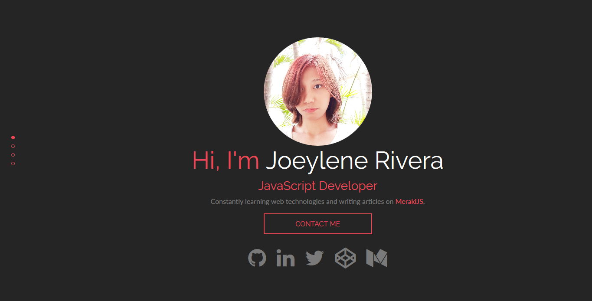

# FCC Personal Portfolio | Joeylene Rivera

A personal portfolio made as a requirement of the Free Code Camp's Front End Development Course.

## Third Party Sources - Technologies

* [Page Piling](https://github.com/alvarotrigo/pagePiling.js)
* [Radar Charts by ZingChart](https://codepen.io/zingchart/pen/WZygqq?editors=1010)
* [Form Spree](https://formspree.io/)
* [Image Caption Animation](https://1stwebdesigner.com/image-caption-animation-css3/)

## License

This project is licensed under the Apache 2.0 License - see the [License.md](LICENSE) file for details
